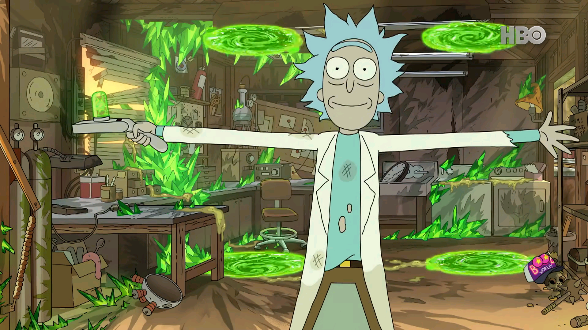

 
<h1 align="center">
Welcome to embeddedboys.org!
</h1>

     

Here are people who love DIY.

If you have a meaningful idea, don't waste it.

let's make it real.

I hope you guys have fun with these.

Cheers,

The offical site will always at [https://embeddedboys.github.io](https://embeddedboys.github.io)

<!--

**Here are some ideas to get you started:**

🙋‍♀️ A short introduction - what is your organization all about?
🌈 Contribution guidelines - how can the community get involved?
👩‍💻 Useful resources - where can the community find your docs? Is there anything else the community should know?
🍿 Fun facts - what does your team eat for breakfast?
🧙 Remember, you can do mighty things with the power of [Markdown](https://docs.github.com/github/writing-on-github/getting-started-with-writing-and-formatting-on-github/basic-writing-and-formatting-syntax)
-->
